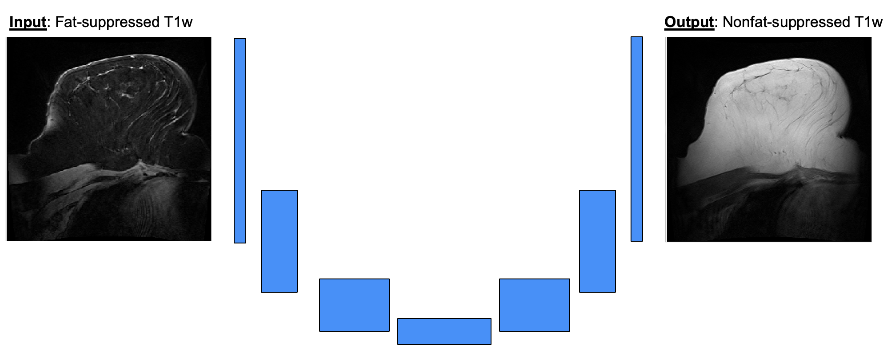

# Sat2Nu

PURPOSE: To develop a supervised learning framework, Sat2Nu, using a shallow U-Net architecture that synthesizes nonfat-supporessed breast MRIs from fat-suppressed inputs.

MOTIVATION: Standard of care breast MRI typically only includes fat-suppressed images, where the fat signal is nulled and the hormone-responsive tissue is bright. Sometimes, however, the nonfat-suppressed images (fat signal is bright, hormone-responsive tissue is dark) is necessary for evaluting fat necrosis and fatty lesions as well as for downstream quantitative tasks involving segmentation of the hormone responsive tissue (an easier task on nonfat-suppressed images)

Training from scratch on your own dataset:
To use this pipeline for your own research, please follow these steps:
1. Clone this repo at https://github.com/kslav/sat2nu.git
2. Create a Python virtual environment using `python -m venv /path/to/new/virtual/environment`
3. Activate the virtual environment (see https://docs.python.org/3/library/venv.html) and run `pip install -r deepcontrast/requirements.txt`
4. Create a configs file using the template at `deepinpy/configs/testing_code_example.json` with your desired parameters
5. If not using Optuna for hyperparameter optimization, simply run `python main.py --config path/to/config`. Else, if using optuna, set the `hyperopt_optuna` flag to true in your config file and configure the parameter ranges at the beginning of `objective(trial)` (lines 34-47) in `main_optuna.py`; then run `python main_optuna.py --config path/to-config`

Preliminary results of this work are available in the proceedings of the International Workshop on Breast Imaging, [linked here](https://www.spiedigitallibrary.org/conference-proceedings-of-spie/13174/1317416/Sat2Nu--a-modular-deep-learning-pipeline-for-converting-fat/10.1117/12.3027028.full#_=_)